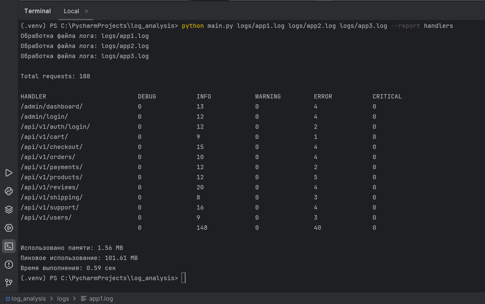
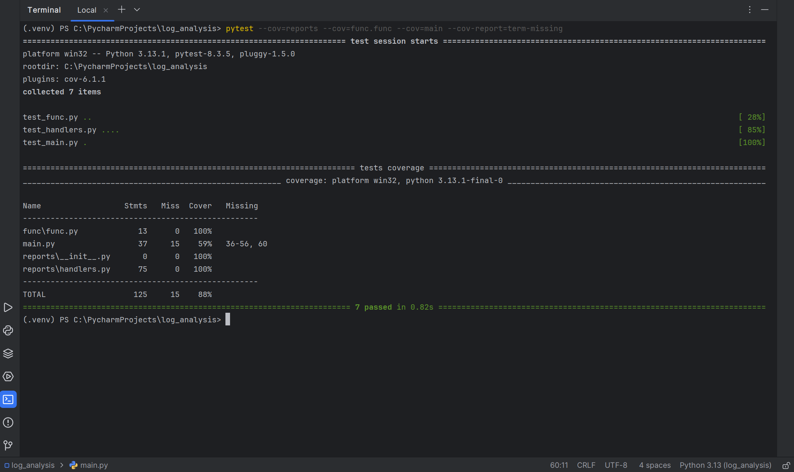

# Анализ журнала логирования
## Описание
CLI-приложение, которое анализирует логи django-приложения и формирует отчеты. 

Отчет выводится в консоль. 

### Интерфейс приложения:
* можно передать пути к логам, файлов может быть несколько
* можно указать аргумент --report c названием отчета который нужно сформировать

Примеры файлов с логами расположены в '/logs'

Логика формирования отчётов расположена в '/reports'. 
Для каждого вида отчёта должен быть свой файл с логикой. Пример: '/reports/handlers.py'

Отчёт может формироваться на основе нескольких файлов.
Каждый лог-файл обрабатывается отдельно, а после обработки данные объединяются в один отчёт. 
Например, нужно посчитать общее количество запросов: в файле app1.log — 3 млн запросов, 
а в файле app2.log — 2 млн запросов, итого в отчете будет 5 млн запросов.

При обработке каждого лог-файла, он разбивается на части заданного размера, чтобы ограничить использование ОЗУ 
(если загружать лог-файлы целиком) или частое чтение с диска (если читать построчно).
Затем эта часть разбивается ещё на равные части примерно по количеству заданных процессов и отдаётся 
на параллельное выполнение.
Затем отчёты объединяются.
Это позволило ускорить выполнение более чем в 10 раз, по сравнению с однопоточной версией. 
Особенно это заметно на лог-файлах размером более 1 ГБ.  

### Пример формирование отчёта:
Отчёт о состоянии ручек API по каждому уровню логирования:
* название отчета: handlers
* алгоритм формирования: 
  * считается количество запросов к ручкам, это записи django.requests:
    * по каждой ручке
    * по каждому уровню логирования
    * группируются запросы по ручкам
  * при выводе сортируются ручки в алфавитном порядке
  * последней строчкой выводится общее количество запросов

```
python3 main.py logs/app1.log logs/app2.log logs/app3.log --report handlers
```


### Функциональные возможности
* можно сформировать отчёт (например: handlers) на основе нескольких файлов
* пути к файлам передаются как аргументы
* название отчета передается как аргумент
* приложение проверяет что указанные файлы существуют
* приложения проверяет что переданное имя отчета верное
* лог-файлы могут быть размером в несколько гигабайт и более
* в архитектуру приложения заложена возможность удобного добавления новых отчётов


### Тестирование с pytest
```
pytest --cov=reports --cov=func.func --cov=main --cov-report=term-missing
```

